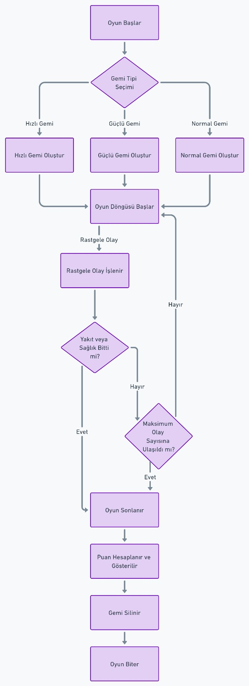

# COSMIC VOYAGER 🚀

**Turn-based console adventure game written in C++.**  
Final project for university course — Developed using modular structure and CMake.

## 🎮 Gameplay Demo
Watch the game in action on YouTube:  
📺 [COSMIC VOYAGER – Gameplay Demo](https://youtu.be/acUWTnehirk)

## 🧩 Features
- Modular design with `.cpp` and `.h` files
- Space-themed turn-based adventure mechanics
- Console-based user interaction
- Cross-platform compilation with CMake
- Includes gameplay demo video and architectural diagram

## 📷 System Diagram


## 🛠️ Build Instructions

```bash
git clone https://github.com/Coskunruhi/COSMIC_VOYAGER.git
cd COSMIC_VOYAGER
mkdir build
cd build
cmake ..
make
./COSMIC_VOYAGER
